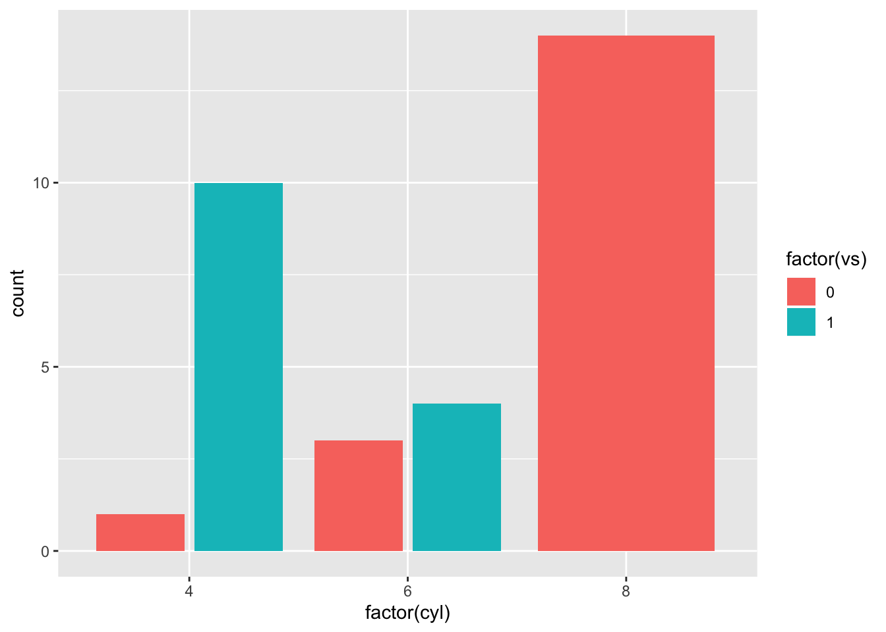

# Applications

Some _significant_ applications are demonstrated in this chapter.

## Example one

## Example two


```r
library(tidyverse)
```

```
## ── Attaching packages ───────────────────────────────────────────────────────────────────────────── tidyverse 1.2.1 ──
```

```
## ✔ ggplot2 3.2.0     ✔ purrr   0.3.2
## ✔ tibble  2.1.3     ✔ dplyr   0.8.3
## ✔ tidyr   0.8.3     ✔ stringr 1.4.0
## ✔ readr   1.3.1     ✔ forcats 0.4.0
```

```
## ── Conflicts ──────────────────────────────────────────────────────────────────────────────── tidyverse_conflicts() ──
## ✖ dplyr::filter() masks stats::filter()
## ✖ dplyr::lag()    masks stats::lag()
```

```r
starwars %>% 
  count(homeworld, sort = TRUE)
```

```
## # A tibble: 49 x 2
##    homeworld     n
##    <chr>     <int>
##  1 Naboo        11
##  2 Tatooine     10
##  3 <NA>         10
##  4 Alderaan      3
##  5 Coruscant     3
##  6 Kamino        3
##  7 Corellia      2
##  8 Kashyyyk      2
##  9 Mirial        2
## 10 Ryloth        2
## # … with 39 more rows
```


```r
library(tidyverse)
starwars %>% 
  count(homeworld, sort = TRUE)
#> # A tibble: 49 x 2
#>    homeworld     n
#>    <chr>     <int>
#>  1 Naboo        11
#>  2 Tatooine     10
#>  3 <NA>         10
#>  4 Alderaan      3
#>  5 Coruscant     3
#>  6 Kamino        3
#>  7 Corellia      2
#>  8 Kashyyyk      2
#>  9 Mirial        2
#> 10 Ryloth        2
#> # … with 39 more rows
```


Our `setup` code chunk above affects *all* code chunks. It is called a global chunk option for that reason. You can (and should) use individual chunk options too, but setting up some nice ones that apply to all code chunks can save you time and can lessen your cognitive load as you create your content.


## Two plots side-by-side


```r
ggplot(mtcars, aes(factor(cyl), fill = factor(vs))) +
  geom_bar(position = position_dodge(preserve = "total"))

ggplot(mtcars, aes(factor(cyl), fill = factor(vs))) +
  geom_bar(position = position_dodge2(preserve = "total"))
```




## Include verbatim code chunks

You may have noticed that the code chunk output, even when `echo=TRUE`, does not show the actual code chunk options that you see in your .Rmd file. In order to print the full code chunk, you'll need to 

+ [verbatim code chunks](https://yihui.name/en/2017/11/knitr-verbatim-code-chunk/)

+ `knitr` [ref.label](https://yihui.name/knitr/demo/reference/) to reuse code chunks
+ the `fig.path` thing: https://yihui.name/knitr/options/#plots (see also: name your code chunks!)
+ making sure that your package warnings/messages don't print!
+ how to control numbers of digits that print 
+ control significance stars


```r
options(
  show.signif.stars = FALSE,     
  digits = 2
  )
```
